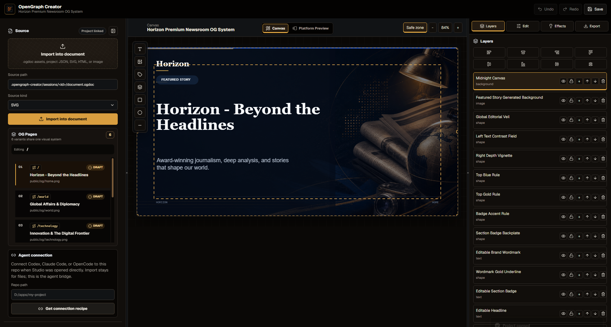

# OpenGraph Creator

OpenGraph Creator is an agent-first Open Graph image studio for app repositories.

Your coding agent, such as Codex, Claude Code, or OpenCode, inspects the app and creates an editable `.ogdoc` document. OpenGraph Creator Studio opens that document, lets you edit the OG image visually, previews platform crops, exports optimized `1200x630` assets, and writes handoff files so the agent can wire the final image into the app.

OpenGraph Creator does not call OpenAI, Anthropic, or image-generation providers directly. Generation belongs to the coding agent. Studio owns editing, preview, export, compression, recovery, and handoff.



## Install Skill

Install the skill from GitHub for all supported local agents:

```bash
npx skills add -g Rajikshank/opengraph-creator --skill opengraph-creator --agent "*" -y
```

Check the Studio runtime:

```bash
npx -y opengraph-creator@latest doctor --json
```

Then open your app in Codex, Claude Code, or OpenCode and ask for an editable Open Graph image. The installed skill should inspect the app, ask the required design questions, create a `.ogdoc`, launch Studio, and wait for your publish decision.

## Run Studio

You can also open Studio directly from any app repo:

```bash
npx -y opengraph-creator@latest studio --repo .
```

Manual launch opens the Project Hub. Agent launch opens the generated session document directly.

## Agent Workflow

After the skill is installed, open your app in Codex, Claude Code, or OpenCode and ask for an editable Open Graph image. The agent should inspect the app, ask the relevant design questions, create the `.ogdoc` session, launch Studio, and wait for your publish decision.

## How It Works

OpenGraph Creator uses a file-based bridge so different coding agents can cooperate with Studio safely:

```text
.opengraph-creator/sessions/<id>/
  session.json
  events.jsonl
  document.ogdoc
  incoming/
  export.json
  publish-request.json
  agent-request.json
  studio.json
```

The protected workflow is:

1. The installed skill inspects the app.
2. The agent asks only relevant designer-style questions.
3. The agent creates an editable `.ogdoc` master document.
4. Studio opens automatically with that document.
5. You edit layers, preview platform crops, and export.
6. Studio writes publish handoff files.
7. The agent resumes and wires metadata only after confirmation.

## The `.ogdoc` Format

`.ogdoc` is the editable source of truth. It stores project JSON, packaged assets, recovery metadata, and layered composition data.

Flat PNG, WebP, JPEG, SVG, HTML, and JSON files can be imported as assets or exported as final outputs, but they do not replace `.ogdoc` unless the user explicitly chooses a pure-image fallback.

## Studio Features

- Editable text, image, logo, screenshot, shape, badge, and background layers.
- Image upload, replacement, crop, focal point, fit mode, and asset packaging.
- Typography controls for font, size, weight, style, color, line height, letter spacing, stroke, and stroke width.
- Shape controls for fill, border, radius, opacity, rotation, skew, perspective, snap, and transform.
- Effects for supported layer types: blur, shadow, glow, gradient, noise/grain, lighting, vignette, and blend mode.
- Layer controls for select, reorder, hide, lock, duplicate, delete, align, and distribute.
- Undo/redo with bounded history and keyboard shortcuts.
- Platform previews for X/Twitter, LinkedIn, Facebook, Discord, Slack, WhatsApp, iMessage, and browser/search.
- Export to exact `1200x630` PNG, WebP, JPEG, or SVG source.

Unsupported layer/effect combinations are hidden or disabled. The UI should not show fake-functional controls.

## Agent Commands

These are the core commands the skill uses behind the scenes:

```bash
opengraph-creator session create --repo . --agent codex --strategy hybrid --mode template
opengraph-creator document validate --source ".opengraph-creator/sessions/<id>/document.ogdoc"
opengraph-creator session launch --repo . --id "<id>" --open true --waitReady true --json
opengraph-creator session wait --repo . --id "<id>" --until next-action --timeout 0
```

When `next-action` returns:

- `agent-requested`: the agent reads `agent-request.json`, revises `document.ogdoc`, validates, relaunches Studio, and waits again.
- `published`: the agent reads confirmed `publish-request.json`, previews the metadata change, then wires it into the app.
- `cancelled` or `terminal`: the agent stops without metadata mutation.

## Updating

Update the installed skill:

```bash
npx skills update opengraph-creator
```

Use the latest Studio runtime:

```bash
npx -y opengraph-creator@latest doctor --json
```

To target only one agent:

```bash
npx skills add -g Rajikshank/opengraph-creator --skill opengraph-creator --agent codex -y
npx skills add -g Rajikshank/opengraph-creator --skill opengraph-creator --agent claude-code -y
npx skills add -g Rajikshank/opengraph-creator --skill opengraph-creator --agent opencode -y
```

For local repair only, use:

```bash
opengraph-creator install-skill --agent codex --scope global
```

Normal users should install through `npx skills add`, not by cloning this repository.

## Development

```bash
npm install
npm run build
npm test
npm run typecheck
npm run lint
npm run smoke:workflow
npm run smoke:agent-handoff
npm run smoke:agent-next-action
npm run smoke:package
npm run smoke:studio
npm pack -w opengraph-creator --dry-run
```

Run Studio locally:

```bash
npm run opengraph-creator -- studio --repo .
```

## Package Layout

- `packages/core`: schema, validation, platform warnings, effect capabilities, and `.ogdoc` package support.
- `packages/render`: SVG renderer and PNG/WebP/JPEG export pipeline.
- `packages/studio`: React/Vite creative-tool interface.
- `packages/cli`: CLI, local Studio server, sessions, packaging, skill install, and publish helpers.
- `skills/opengraph-creator`: the single authored public skill package for Codex, Claude Code, and OpenCode.
- `packages/cli/codex-skill` and `packages/cli/studio-dist`: generated during `npm run build` for the packed npm runtime; they are not committed source.
- `scripts`: workflow, package, handoff, agent, and Studio smoke tests.

## Release

1. Confirm the release gate passes:

```bash
npm run build
npm test
npm run typecheck
npm run lint
npm run smoke:workflow
npm run smoke:agent-handoff
npm run smoke:agent-next-action
npm run smoke:package
npm run smoke:studio
npm pack -w opengraph-creator --dry-run
```

2. Push `main` to GitHub.
3. Log in to npm with `npm login`.
4. Publish the runtime:

```bash
npm publish -w opengraph-creator --access public
```

5. Test a real install from a separate app:

```bash
npx skills add -g Rajikshank/opengraph-creator --skill opengraph-creator --agent "*" -y
npx -y opengraph-creator@latest doctor --json
```

## Boundaries

- Studio does not call provider APIs or require provider API keys.
- Metadata is never changed by Studio alone.
- Platform previews are local simulations. Deployed URLs should still be checked with live social validators before launch.
- Dynamic framework metadata can still require human review after OpenGraph Creator writes a confirmed handoff.
